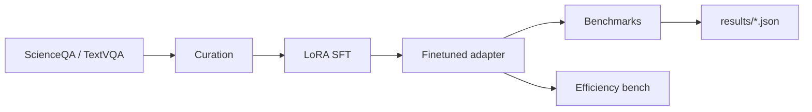

# VLM Production Lab

End-to-end **vision–language model (VLM)** post-training toolkit built for production-minded research: **dataset curation**, **LoRA supervised fine-tuning**, **benchmark evaluation**, **hallucination probing**, and **efficiency benchmarking**.

**Author:** [Weichen Zheng](https://www.linkedin.com/in/weichen-zheng)  
**Target use:** Portfolio / open-source evidence for multimodal AI research roles (e.g. VLM post-training, eval, deployment).

---

## What this project demonstrates

| Tether job theme | This repo |
|------------------|-----------|
| Post-training (SFT, distillation, RLHF) | **LoRA SFT** on `Qwen2-VL-2B-Instruct` with PEFT + 4-bit training |
| Multimodal data curation | `src/data/curate.py` — filter, subject balancing, train/val split, JSONL export |
| Evaluation & benchmarks | ScienceQA + TextVQA subsets; per-subject accuracy; **hallucination probe** |
| Resource-constrained deployment | 4-bit load, latency/VRAM benchmark in `src/deploy/efficiency_benchmark.py` |
| Engineering discipline | Config-driven YAML, reproducible scripts, metric JSON artifacts |

---

## Architecture



---

## Quick start

### 1. Environment

```powershell
cd e:\Projects\vlm-production-lab
python -m venv .venv
.\.venv\Scripts\Activate.ps1
pip install -r requirements.txt
```

**Hardware:** NVIDIA GPU with **≥12 GB VRAM** recommended (Qwen2-VL-2B + 4-bit LoRA). CPU-only can run `run_smoke.py` but not full training/eval.

### 2. Smoke test (no GPU)

```powershell
python scripts/run_smoke.py
```

### 3. Full pipeline (GPU)

```powershell
.\scripts\run_pipeline.ps1
```

Or step by step:

```powershell
python -m src.data.curate --max-samples 512 --out-dir data/curated
python -m src.train.sft_lora --config configs/sft_lora.yaml
python -m src.eval.benchmarks --config configs/eval.yaml --smoke   # quick
python -m src.eval.benchmarks --config configs/eval.yaml           # full
python -m src.deploy.efficiency_benchmark
```

### 4. Google Colab (no local GPU)

1. Upload this folder or clone your GitHub repo.
2. Runtime → **T4 GPU**.
3. Run the same commands as above (`pip install -r requirements.txt` first).
4. Download `results/eval_finetuned.json` and add numbers to your resume.

---

## Expected outputs

After a successful run you should have:

| Path | Description |
|------|-------------|
| `data/curated/curation_report.json` | Sample counts, subject balance |
| `outputs/lora-sft/` | LoRA adapter + processor |
| `results/eval_baseline.json` | Metrics before fine-tune (run eval without adapter) |
| `results/eval_finetuned.json` | Metrics after LoRA SFT |
| `results/efficiency.json` | Latency ms + peak VRAM (4-bit vs bf16) |

**Report template:** `results/eval_report_example.json`

### Example results table (fill after you run)

| Model | ScienceQA EM ↑ | TextVQA EM ↑ | Hallucination rate ↓ |
|-------|------------------|--------------|----------------------|
| Qwen2-VL-2B baseline | _TBD_ | _TBD_ | _TBD_ |
| + LoRA SFT (512 samples) | _TBD_ | _TBD_ | _TBD_ |

---

## Project layout

```
vlm-production-lab/
├── configs/           # sft_lora.yaml, eval.yaml
├── src/
│   ├── data/          # curation + schema
│   ├── train/         # LoRA SFT
│   ├── eval/          # benchmarks + hallucination probe
│   └── deploy/        # latency / VRAM
├── scripts/
├── results/
└── requirements.txt
```

---

## Publish to GitHub (for Tether application)

```powershell
cd e:\Projects\vlm-production-lab
git init
git add .
git commit -m "Add VLM production lab: LoRA SFT, eval harness, efficiency benchmarks"
# Create repo on GitHub, then:
git remote add origin https://github.com/YOUR_USERNAME/vlm-production-lab.git
git push -u origin main
```

Use the repo URL in your Tether application **links** question.

---

## Optional: Hugging Face

```powershell
pip install huggingface_hub
huggingface-cli login
huggingface-cli upload YOUR_USERNAME/qwen2vl-scienceqa-lora outputs/lora-sft .
```

---

## License

MIT — free to use and fork.

---

## Citation

If this work helps your hiring process, link to the repo and note: **LoRA fine-tune of Qwen2-VL-2B on ScienceQA with custom eval + hallucination probe.**
